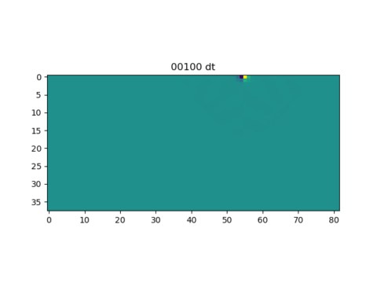

finite differences 3d code
==========================

A 3D finite differences code for elastic wave propagation. Uses a staggered grid in the stress velocity formulation. 
Includes absorbing boundaries with the Perfect Matching Layer method.
The example provided is a small footprint model with a reduced number of nodes. 
The example simulates a spherical void buried in a homogeneous half space with free surface on top, energised by a vertical force at the surface.

- triffy.f90: main code and subroutines
- triffy.dec: declarations of variables
- parameters.f: size of grid (do not alter the -2+npm+6 as this is needed for PML boundaries)
- fpar: parameters of simulations that are read on the run
- dx/dt should be proportional to maximum wave velocity in medium to allow for stability of the code. A value dx/dt > 5 vmax is advised, however code may still run without instability in some cases with sqrt(3) > dx/dt 
- dx should be sufficiently small to sample the minimum wavelength correctly, to reduce numerical dispersion.
Usually the surface or Rayleigh wave is the most numerically dispersive, being the slowest and most localised wave most times.  
- medium velocity for P and S wave is $c_P=\sqrt{(\mu + 2 \lambda)/\rho}$
and $c_S=\sqrt{\mu/\rho}$, respectively, where $\mu$ is shear modulus, $\lambda$ is Lame parameter and $\rho$ is mass density. 
- Rayleigh (surface waves) are slightly slower than S wave. Their exact velocity $c_R$ depends on the specific Poisson ratio; in a homogeneous half-space an approximate Rayleigh wave velocity is ${\displaystyle c_{R}=c_{S}{\frac {0.862+1.14\nu }{1+\nu }}}$. Note that other types of inhomogeneous waves that are also dispersive arise in the presence of layering/inhomogeneity (e.g. Stoneley, Love).  
- additional routines defined in other f90 files are used for PML absorbing boundaries only, and need not be modified.
- free surface is implemented in first j (y) layers using the mirror method (symmetry / antisymmetry of stress and velocity).
- PML absorbing boundaries are implemented on all other sides of cuboid
